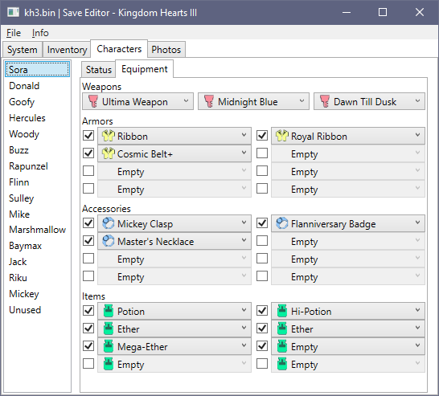

---

This is the repository for a Windows application that allows to modify decrypted saves of Kingdom Hearts series games.

The project offers a code library to help to create complex editors of scripts of any kind and on any operating system, plus a "in-house" editor compatible with Windows 7 or above (the only minimum requirement is .Net Framework 4.7.2 Rumtime). Not all the games are supported by the library and not all the library implementations has their editor. Yet.

| Game                   | Support |
|------------------------| --------|
| Kingdom Hearts Re: CoM | PS2/PS4 |
| Kingdom Hearts II      | PS2/PS4 |
| Kingdom Hearts 0.2     | PS4     |
| Kingdom Hearts III     | PS4     |

Here is a screenshot preview of how the editor in action looks like:

## Features in Kingdom Hearts III editor

* Tested support for the version 1.05 of Kingdom Hearts III
* Change game difficulty (even Critical Mode in version 1.03 or below)
* Make new saves compatible with older versions (advanced feature)
* Info and decorations (eg. game timer, save icons)
* Exp, Munny
* Manage story progression!
* Statistics (eg. save count)
* Inventory editor
    * Set items count between 0 and 255
    * Set flags (unseen, shop, collected)
    * Group editing
    * Search filter
        * Filter by name
        * Filter by quantity (eg `=0`, `>50`, `<99`)
        * Filter by unobtained (`obtained`, `!obtained`)
        * Filter by shop availability (`shop`, `!shop`)
* Sora and partners editor:
    * HP, MP, Focus, parameter boosts
    * Weapons equipped
    * Armors equipped
    * Accessories equipped
	* Ability support
* Records
    * Minigames
    * Flantastics
    * Shotlocks
* Photo gallery management
    * View the existing photos
    * Export one or all the photos
    * Import custom photo in the game
    * Delete all the photos
    
# Features in Kingdom Hearts II editor

* Shortcuts editor
* Character editor
    * Statistics
    * Equipment
    
# Features in Kingdom Hearts 0.2 editor

* Multiple slot editing
* Change game difficulty
* Exp editor and level up
* Room mod
    
# Features in Kingdom Hearts Re: CoM

* Difficulty and system flags
* Card inventory
* Story progress
* Settings

## How to use it for PS4 games

You need first to get a decrypted save. There are two ways to achieve it:

1) Playstation 4 Save Mounter: If you have a PS4 with a HEN or Custom Firmware, you may want to use this free and fast tool: https://github.com/ChendoChap/Playstation-4-Save-Mounter

2) Save Wizard: If you do not have a custom firmware, you can obtain a copy of a decrypted save and re-encrypt it using the following paid software: https://www.savewizard.net/

Once you get your save, just open it using the KH3SaveEditor from File\Open, then save it with File\Save. If you want to transfer back the file on your Playstation 4, just follow the guide lines of the tool that you used for decryption

## Use saves from Kingdom Hearts 1.05

The latest version of the game converts your existing 1.00-1.03 save into a new version, creating a `kh3sv2`, which is a copy of `kh3sv` with few values changed.

The version 1.05 changes only three values when it converts your saves: the major/minor version goes from 1.2 to 3.1 (editable in Advance Mode) and the Max selfie count value goes from 100 to 200.

## How to use it for PS2 games

The editor works on the raw save data from PS2 save game files. As long as you can extract the save slot from the memory card or from your favourite emulator, you can edit it. A native support for reading the save without extracting it from its container will come in a near future.

## Contribute to make it better

This software is open-source, and every contribution is more than welcome!

If you want to add missing names, improve it or add new offsets, just clone the repository, do your change, test if it does work and create a pull request: we will review your change (no needs to be scared here) and we will merge it to this repo! Do not be shy on contribute, even for the smallest thing :)

## What's next

The following features are missing:
* Chests
* Cuisine editor
* Everything related to the Gummiphone

## To conclude

The code itself, the interface and the codes inside it are protected by GPL 3.0 license. In short, that means that for every change you made or code that you take from here, you need to make it open source somewhere, adding the original copyright statement and specify where the original code has been taken.

If you have more doubts about the GPL license, have a read to the following links:

https://tldrlegal.com/license/gnu-general-public-license-v3-(gpl-3)
https://simple.wikipedia.org/wiki/GNU_General_Public_License
